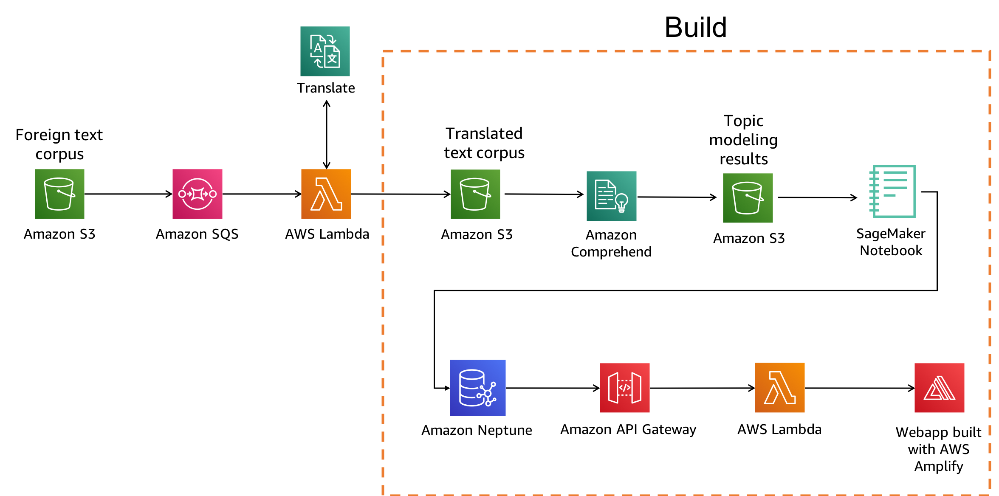

# Understanding a large amount of text by modeling & visualizing topics

## Architecture




## Setup


1. In the S3 console, create a bucket in the US West (Oregon) region (region code `us-west-2`). Use a unique name, e.g. `large-text-understanding-{username}`
1. Enable CORS on the bucket using the below policy

    ```xml
    <?xml version="1.0" encoding="UTF-8"?>
    <CORSConfiguration xmlns="http://s3.amazonaws.com/doc/2006-03-01/">
    <CORSRule>
        <AllowedOrigin>*</AllowedOrigin>
        <AllowedMethod>GET</AllowedMethod>
        <MaxAgeSeconds>3000</MaxAgeSeconds>
        <ExposeHeader>x-amz-server-side-encryption</ExposeHeader>
        <ExposeHeader>x-amz-request-id</ExposeHeader>
        <ExposeHeader>x-amz-id-2</ExposeHeader>
        <AllowedHeader>*</AllowedHeader>
    </CORSRule>
    </CORSConfiguration>
    
    ```
1. Launch cloudformation stack: 

	[](https://console.aws.amazon.com/cloudformation/home?region=us-west-2#/stacks/new?stackName=large-text-understanding&templateURL=https://s3.amazonaws.com/large-text-understanding/cloudformation/topic-modeling-master.yaml)

## Follow tutorial in Jupyter notebook  
1. Go to [SageMaker console](https://us-west-2.console.aws.amazon.com/sagemaker/home?region=us-west-2#/notebook-instances) and open Jupyter notebook instance once it's ready

1. Navigate into `topic-modeling-visualizations/` and open `Topic Modeling Tutorial.ipynb`

1. Follow steps detailed in the notebook 


## Clean up

1. If you created a cloud9 environment, delete it
1. Delete the `large-text-understanding` CloudFormation stack
1. Delete the s3 bucket you created 


